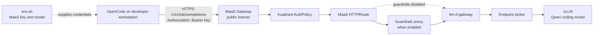
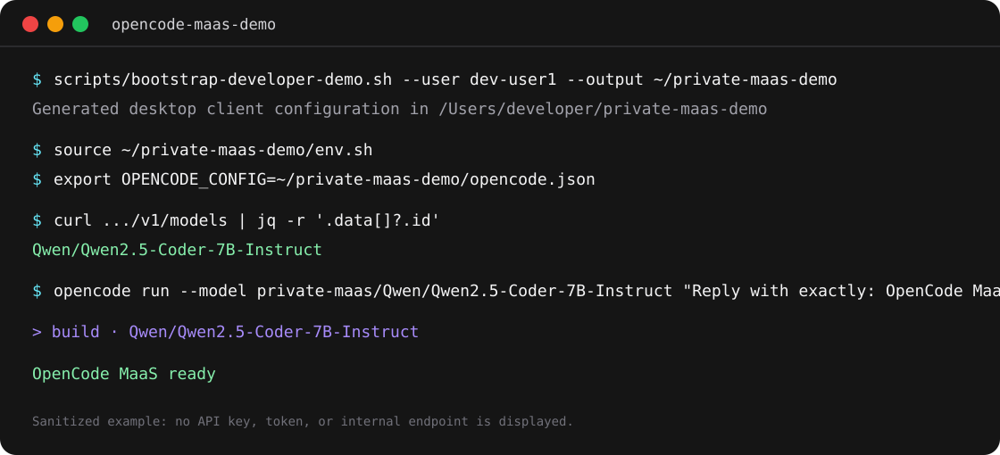
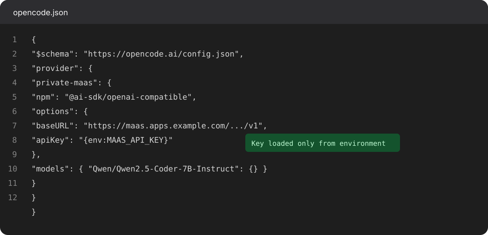

# OpenCode MaaS Demo

Run OpenCode on a developer workstation while keeping the request path inside
the private platform: OpenCode -> MaaS -> llm-d -> vLLM. The workstation gets a
developer-scoped MaaS key, never an llm-d or vLLM address.

## Architecture



The public MaaS listener is the only desktop endpoint. The MaaS AuthPolicy
attributes and validates the developer key before routing the request. Do not
use a vLLM pod, llm-d workload Service, or `*.svc.cluster.local` URL from a
desktop client.



## Prerequisites

- OpenCode installed on the developer workstation.
- `oc` authenticated to the target cluster and `jq` installed.
- A DevWorkspace and `pca-maas-apikey` Secret for the developer. The standard
  example is user `dev-user1` in namespace `dev-user1-devspaces`.
- A public MaaS hostname reachable from the workstation with a certificate the
  workstation trusts.
- Enough free GPU capacity for the selected vLLM deployment to roll out.

The cluster must have a vLLM `--max-model-len` compatible with OpenCode. Current
OpenCode 1.18 sends a request one token beyond its nominal context allowance,
so a runtime configured for a strict 16,384-token maximum rejects the request.
For that runtime, configure at least `--max-model-len=16385` before the demo and
wait for the replacement vLLM pod to become Ready. Do not force a rollout by
overwriting a separately managed replica count.

## Generate The Per-Developer Config

From the repository root, generate a config directory outside the repository:

```bash
scripts/bootstrap-developer-demo.sh --user dev-user1 \
  --openai-base-url "https://maas.apps.example.com/private-assistant-ai-serving/qwen25-coder-7b/v1" \
  --output "$HOME/private-maas-demo"
```

The script reads the model and developer key from the deployed DevWorkspace and
Secret. Generated files are mode `600` and `.demo/` is ignored by Git.



## Start OpenCode

Use `OPENCODE_CONFIG` to preserve an existing global OpenCode configuration:

```bash
source "$HOME/private-maas-demo/env.sh"
export OPENCODE_CONFIG="$HOME/private-maas-demo/opencode.json"
opencode
```

For a non-interactive readiness check:

```bash
opencode run --model "private-maas/$MAAS_MODEL" \
  "Reply with exactly: OpenCode MaaS ready"
```

The generated config passes the key through `{env:MAAS_API_KEY}`. It does not
write the key into `~/.config/opencode/opencode.json` or an OpenCode auth file.

## Validate The Gateway

Before starting OpenCode, verify the same MaaS route returns the configured
model. This diagnostic assumes the workstation trusts the public listener's
certificate:

```bash
source "$HOME/private-maas-demo/env.sh"
curl --fail --silent --show-error \
  --header "Authorization: Bearer $MAAS_API_KEY" \
  "${MAAS_OPENAI_BASE_URL}/models" | jq -r '.data[]?.id'
```

Expected result:

```text
Qwen/Qwen2.5-Coder-7B-Instruct
```

If certificate validation fails, install the organization CA into the operating
system trust store. Do not use `--insecure` or `NODE_TLS_REJECT_UNAUTHORIZED=0`
in the demonstration.

## Presenter Flow

1. Show the traffic diagram and explain that MaaS is the policy boundary.
2. Generate the developer-scoped files and show their `600` permissions, not
   their contents.
3. Run the `/models` validation command and show the Qwen model ID.
4. Launch OpenCode with `OPENCODE_CONFIG`, then ask it to explain or change a
   small file in a local sample project.
5. Show MaaS metrics or logs to connect the client request to gateway usage.
6. Delete `~/private-maas-demo` and rotate the developer key after a shared
   screen demonstration.

## Troubleshooting

| Symptom | Cause | Resolution |
| --- | --- | --- |
| `URL rejected` or DNS failure | The DevWorkspace endpoint is cluster-internal. | Pass a public MaaS URL through `--openai-base-url`. |
| Certificate validation failure | The public listener uses an untrusted certificate. | Install a trusted certificate or the organization CA. |
| `401` or `403` | The developer key is missing, stale, or does not match the MaaS AuthPolicy. | Regenerate the config for the developer and verify the Secret. |
| `max_tokens ... max_model_len` | OpenCode request budget exceeds the vLLM maximum. | Increase `--max-model-len` to at least 16,385 or use a runtime with a larger context limit. |
| New vLLM pod remains Pending | No GPU capacity exists for a rolling update. | Free capacity or coordinate a rollout strategy with the owner of `.spec.replicas`. |

## Related

- [Desktop developer demo](desktop-developer-demo.md)
- [Architecture](architecture.md)
- [Models and routing](models-and-routing.md)
- [Cluster smoke tests](../tests/cluster-smoke/README.md)
